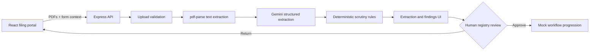

# PIL Filing & Scrutiny Assistant

An AI-assisted prototype that turns Public Interest Litigation (PIL) PDFs into a structured case summary, runs transparent procedural-readiness checks, and presents the result to a human registry reviewer.

> **Hackathon MVP:** procedural assistance only. The system does not assess legal merits, determine maintainability, or replace court staff or judicial decision-making.

## The problem

PIL filings can contain long petitions, affidavits, annexures, and repeated facts spread across multiple PDFs. Registry staff must manually locate essential details, check basic completeness, and surface inconsistencies before a filing can move forward. That work is time-consuming, repetitive, and difficult to audit when findings are buried in free-form notes.

## The solution

This application creates a review-ready first pass:

1. A filer uploads a main petition and optional supporting PDFs.
2. Gemini extracts only document-supported facts into a fixed schema.
3. Deterministic rules convert that structured data into passed checks, warnings, and blocking defects.
4. A human registry reviewer inspects the source-aware results and chooses to approve the filing or return it for correction.

The original documents remain authoritative throughout the workflow.

## End-to-end demo flow

1. **New PIL** — select a court, add optional filing context, and upload one main petition plus up to four supporting PDFs.
2. **AI extraction** — review the case summary, parties, public issue, cause of action, requested relief, dates, statutes, and annexures found in the documents.
3. **Procedural scrutiny** — inspect clearly grouped passes, warnings, and defects, including missing required details and unmatched annexure references.
4. **Registry review** — a human reviews the case overview, documents, and flagged issues.
5. **Human decision** — approve the mock filing into the demonstrated court workflow or return it for correction and re-analysis.

## Major features

- Structured extraction from multiple text-readable PDFs
- Low-temperature Gemini output constrained by a JSON schema
- Explicit handling of missing information instead of invented facts
- Deterministic, testable procedural checks with source labels
- Annexure matching across references, filenames, and extracted text
- Human approval/return loop with a correction path
- PDF-only uploads, 10 MB per-file limits, and in-memory processing
- Clear legal and procedural-assistance disclaimers

## Architecture



PDFs are processed in memory for this prototype and are not permanently stored. The browser calls the Express API through Vite's `/api` proxy during development.

## AI vs. deterministic rules

| Layer | Responsibility | Examples |
| --- | --- | --- |
| **AI-assisted** | Extract and summarize facts explicitly supported by uploaded documents | parties, case summary, cause of action, dates, relief, statutes, affidavit indicators, possible inconsistencies |
| **Deterministic** | Apply visible, repeatable checks to the normalized extraction and document metadata | main petition present, petitioner/respondent detected, relief detected, annexure reference matching, pass/warning/defect counts |
| **Human** | Verify the output against the filing and record the registry action | accept warnings, approve the mock filing, or return it for correction |

AI output is never treated as a final legal conclusion. Missing fields stay empty, findings retain source context, and deterministic defects remain visible to the reviewer.

## Human-in-the-loop design

The system pauses after extraction so a person can inspect the result before scrutiny, then presents every warning and defect again at the registry desk. Approval is always an explicit human action. A reviewer can return a filing, after which the filer can replace documents or edit details and run the analysis again.

## Tech stack

- React 19, Vite 7, and Tailwind CSS 4
- Node.js and Express 5
- Google Gen AI SDK with Gemini
- Multer for guarded multipart uploads
- `pdf-parse` for PDF text extraction
- Node's built-in test runner for scrutiny-rule tests

## Current MVP scope

The MVP supports one main text-readable PIL PDF and up to four supporting PDFs, each no larger than 10 MB. It demonstrates four Indian court options, structured extraction, a fixed set of readiness rules, and mock registry decisions in a single browser session.

It does not yet include OCR for scanned PDFs, authentication, persistent case storage, role-based access, e-filing integration, production-grade audit logs, or jurisdiction-specific rule configuration. The post-approval court stages are illustrative only.

## Screenshots and demo

> **Demo placeholder:** add the deployed application URL, a short walkthrough video/GIF, and current workflow screenshots here before judging.

Suggested screenshots: upload screen, AI extraction, procedural findings, and registry decision.

## Run locally

### Prerequisites

- Node.js 20.19+ and npm
- A Gemini API key for the developer running the backend

### Setup

```bash
npm install
export GEMINI_API_KEY="replace_with_your_development_key"
npm run dev
```

Open `http://localhost:5000`. The frontend runs on port `5000`, proxies `/api` to the backend on port `3001`, and exposes a health check at `GET /api/health`.

`backend/.env.example` is a placeholder-only reference. If you create `backend/.env` for local secret storage, keep it uncommitted; it is ignored by Git. The application reads `GEMINI_API_KEY` from the backend process environment and does not automatically load that file.

### Verify

```bash
npm test
npm run build
curl http://localhost:3001/api/health
```

## Deployment secret

`GEMINI_API_KEY` is a **server-side deployment secret**. For production or Replit deployment, configure it in the host's server-side Secrets/Environment Variables settings so it is available to the Express process.

Application users never provide their own Gemini API key. Never place the key in frontend code, browser storage, a `VITE_*` variable, source control, screenshots, or logs. Keep `backend/.env` ignored and commit only the placeholder `backend/.env.example`.
